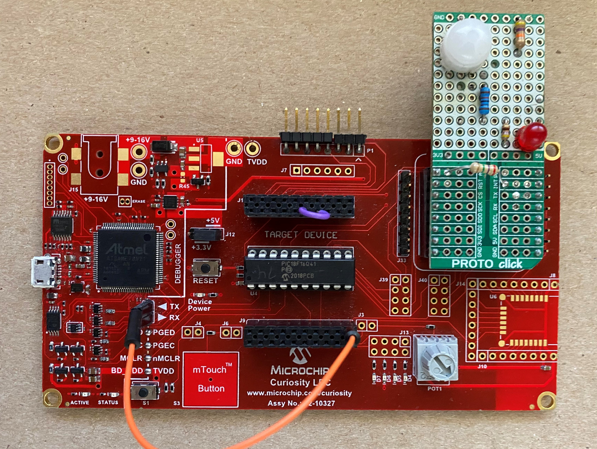

<a href="https://www.microchip.com" rel="nofollow"></a>


## Objective:
The "pic18f16q41-pir-sensor" project highlights the advanced analog peripherals found on the PIC18-Q41 family of devices such as the Operational Amplifier (OPA) module, the 8-bit Digital-to-Analog Converter (DAC), the advanced Analog-to-Digital Converter with Computation (ADCC) and the Comparator (CMP) module. This code example combines multiple core independent peripherals (CIPs) to create a Passive Infrared (PIR) Sensor Alarm system that operates with minimal CPU usage and with power-saving and cost reduction in mind. By fully utilizing the available peripherals found on the PIC18F16Q41 and the ability to interconnect them internally, the number of external components used was reduced and the overall system design was further simplified. The PIR sensor alarm system created in this code example was designed to continually monitor the immediate surrounding area to detect motion or the presence of a person, and trigger an LED when a detection has occurred. A potentiometer is also used to adjust the duration of time that the LED remains on after motion has been detected.  

## Software Used:
  - MPLAB® X IDE 5.40 or newer [(microchip.com/mplab/mplab-x-ide)](http://www.microchip.com/mplab/mplab-x-ide)
  - MPLAB® XC8 2.20 or a newer compiler [(microchip.com/mplab/compilers)](http://www.microchip.com/mplab/compilers)
  - MPLAB® Code Configurator (MCC) 3.95.0 or newer [(microchip.com/mplab/mplab-code-configurator)](https://www.microchip.com/mplab/mplab-code-configurator)
  - MPLAB® Code Configurator (MCC) Device Libraries PIC10 / PIC12 / PIC16 / PIC18 MCUs [(microchip.com/mplab/mplab-code-configurator)](https://www.microchip.com/mplab/mplab-code-configurator)
  - Microchip PIC18F-Q Series Device Support (1.5.124) or newer [(packs.download.microchip.com/)](https://packs.download.microchip.com/)

## Hardware Used:
  - [PIC18F16Q41 Microcontroller](https://www.microchip.com/wwwproducts/en/PIC18F16Q41)
  - [Curiosity Low Pin Count (LPC) Development Board - Rev 4](https://www.microchip.com/DevelopmentTools/ProductDetails/DM164137)
  - [muRata Pyro Electric Infrared Sensor with Fresnel Lens ](https://www.murata.com/~/media/webrenewal/products/sensor/infrared/datasheet_pir.ashx?la=en)
  - [MikroElektronika PROTO Click Board](https://www.mikroe.com/proto-click)
  - Miscellaneous discrete components as described in the PIR Alarm Circuit below

## PIR Alarm Circuit:
The PIR sensor used in this code example uses an interface circuit that removes the DC bias present in the raw analog sensor output signal, and provides enough amplification to the remaining small signal so that any voltage swing when motion is detected can be measured by the PIC microcontroller. The following figure shows the complete schematic used in this code example.

</a>

As previously mentioned, this code example implements several core independent peripherals to reduce the amount of external components used in the design. The following figure illustrates what the sensor interface circuit looks with the internal microcontroller peripherals included and shows the connections between those peripherals. This figure makes it easier to visualize how each peripheral interconnects with each other to create the complete system in this code example. The sections below pertaining to each peripheral used will go into more detail about how this interface circuit was designed.

</a>

## Demo Configuration:
The Curiosity Low Pin Count (LPC) Development Board (Part # DM164137) was selected as the development platform for this code example. The PIR sensor interface circuit and the LED used to show when motion has been detected was built up on a MikroElektronika PROTO click board and connected to the Curiosity LPC Development Board. The potentiometer shown in the circuit above was already provided on the Curiosity LPC Development Board (POT1). Most connections needed for this code example were made on the circuit built using the PROTO click board. A jumper wire was needed to connect the OPA1OUT pin (RC2) to the Comparator 1 Negative Input (C1IN1-) on RC1. Additionally the UART TX pin (RB7) was connected to the virtual communication port on the Curiosity LPC development board using a jumper wire as well. The following table summarizes the signal connections used in this code example:

|Signal                               | Microcontroller Pin            |
|-------------------------------------|--------------------------------|
|OPA Inverting Input (OPA1IN2-)       | RA2 (PIR Raw Output)           |
|OPA Non-Inverting Input (OPA1IN0+)   | RB5 (Connected to DAC1)        |
|OPA Output (OPA1OUT)                 | RC2 (Connected to ADCC & CMP1) |
|Comparator Negative Input (C1IN1-)   | RC1 (connected to OPA1OUT)     |
|Comparator Output (C1OUT)            | RB4                            |
|Curiosity LPC Potentiometer 1        | RC0 (LED Timeout Control)      |
|UART TX                              | RB7                            |
|PIR Alarm LED                        | RA4                            |

## Curiosity LPC Project Setup:
The following image shows the complete project setup on the Curiosity LPC development board.

</a>

## Operational Amplifier (OPA) Module:
The OPA module was used in this code example to remove the DC bias from the raw PIR sensor output and amplify the remaining small signal so that it could be measured using the ADCC peripheral. The raw output signal of the PIR sensor had a DC bias of approximately 600mV. The DAC1 Module was configured to provide a voltage of around 600mV and connected internally to the OPA non-inverting input (OPA1IN0+) to compensate for the DC bias. The following figure shows the raw output voltage from the PIR sensor (with the DC bias previously mentioned) when presence has been detected. Without the proper analog signal conditioning it would be much more difficult to distinguish the presence of somebody walking into a room from a "false-trigger". Although the waveform below does show that the signal swung around 100mV when presence was detected, this waveform was captured by waving somebody's hand directly across the PIR lens. The voltage swing when somebody walks into the room in comparison is almost indistinguishable.  

</a>

The raw output of the PIR sensor was connected to the OPA inverting input (OPA1IN2-) with the feedback network illustrated in the schematic. The feedback network was used to provide a gain of 251 to the PIR output (minus the DC bias compensated for using the DAC1 module). The OPA module of the PIC18-Q41 was able to successfully condition the PIR output enough so that it could be effectively used by the microcontroller to determine when presence has been detected. The MPLAB Code Configurator (MCC) was used to configure the OPA module, and the OPA was setup so that both inputs and the output would be directly connected to the specified pins.

</a>

## Analog-to-Digital Converter with Computation (ADCC) Module:
The ADCC was used in this code example to continually monitor the amplified PIR sensor output from the OPA output pin. The amplified PIR sensor output does not remain constant and drifts up and down over time, so the ADCC was used to periodically measure the voltage and check if the output drifted enough to potentially cause a false-trigger of the comparator module. The ADCC was configured to use an auto-conversion trigger to automatically measure the PIR output every 100ms. The auto-conversion trigger in this code example was provided using Timer0.

In order to determine if the amplified PIR output was drifting, the computation feature of the ADCC was used. Threshold interrupts were setup so that every time an ADCC conversion occurs, the current conversion result would be compared to the previous result. An upper threshold and lower threshold were configured so that if the signal had changed enough to go outside of those thresholds, it could be determined that the signal was drifting and adjustments could be made to prevent false-triggers. Using the computation feature of the ADCC allowed for the PIR output signal to be monitored for drift without any CPU intervention. The ADCC was also used to measure the Curiosity LPC POT1 whenever presence has been detected and the comparator has been triggered. This potentiometer is used to control how long the LED will stay on when the comparator is triggered. The MPLAB Code Configurator (MCC) was used to configure the ADCC module for this code example as shown below.

</a>

## Comparator (CMP1) Module
The CMP1 module was used in this code example as a trigger to determine whenever presence has been detected by the sensor. The DAC2 output and the amplified PIR output were connected to the comparator to create a trigger that would set whenever the PIR output was equal or greater to the voltage provided by DAC2. DAC2 was setup so that it would provide a voltage that matched the amplified PIR output voltage with an offset applied that would determine the "trigger sensitivity" and control when the comparator output would be set denoting a presence was detected. The MPLAB Code Configurator (MCC) was used to configure the CMP1 module for this code example as shown below.

</a>

 As the PIR output drifts over time it is important to adjust the DAC2 value to prevent false triggers. This is why the ADCC was used to continually monitor the PIR output. Whenever an ADCC threshold interrupt occurs, the system stops and measures the new PIR output value and adjusts the DAC2 output voltage to match that (with the applied offset). The following code snippet shows the routine used whenever the DAC2 output voltage needed to be adjusted to compensate for drift:

```c
void DAC2_DriftCompensation(void) {
    dac_temp = ADCC_GetConversionResult(); // DAC2 drift compensation;
    dac_temp = (dac_temp / ADC_RESOLUTION) * DAC_RESOLUTION; // Calculate DAC2 CMP trigger;
    DAC2DATL = (uint8_t) dac_temp + TRIGGER_SENSITIVITY; // Update DAC2 with calculated value;
}
```

If presence has truly been detected and the output of the PIR sensor is greater than the current DAC2 output voltage, CMP1 will trigger and its corresponding interrupt flag will be set. When presence is detected the ADCC is used to measure the value of POT1 on the Curiosity LPC board, which determines how long the LED on the MikroElektronika PROTO click board stays on for. After measuring POT1, the value is used to adjust the period of Timer1 which is setup in a one-shot configuration to control the timeout of the LED. As soon as the LED is illuminated Timer1 is started. The LED will stay illuminated until the Timer1 interrupt flag is set, at which point the LED will be turned off and Timer1 will be stopped until the comparator is triggered again. The following code snippets are used in this code example to control the LED whenever the comparator has triggered.

```c
void Read_Potentiometer(void) {
    ADPCH = POT1; // Set ADC Positive Channel to Potentiometer;
    ADCON0bits.ADGO = 1; // Start ADC conversion;
    while (ADCON0bits.ADGO); // Wait for conversion to complete;           
    pot_result = ((ADRESH << 8) + ADRESL); // Store ADC conversion result;
    pot_result = pot_result * 14; // Change potentiometer result scale to load tmr1 period;
    TMR1_WriteTimer(pot_result);
}
```
```c
void LED_TimoutControl(void) {
    LATAbits.LATA4 = 1; // Turn on LED;
    printf("CMP1 Interrupt! \r\n");
    TMR1_StartTimer(); // Start LED Timer;
}
```

## Code Example Results
The following waveform shows the amplified PIR output from the OPA module when presence has been detected in a room. The yellow signal (Source 1) in this waveform shows the OPA output voltage and the green signal (Source 2) shows the status of pin RA4 which is connected to the LED. The amplified PIR output sits around 2.6V at idle but as soon as the sensor detects a presence in the room the output jumps up to around 3.75V. This voltage jump is enough to trigger the comparator and then turn the LED on for the specified duration of time.  

</a>

The following animation shows this demo working in real-time. As somebody walks into the room, the LED on the PROTO click board will illuminate for a few seconds and then turn off. The LED becomes illuminated when the CMP1 module is triggered meaning that presence has been detected. The same waveforms as shown in the figure above, are also displayed in the animation below to get a better understand of how the complete demo functions. The potentiometer on the lower right-hand side of the board can be adjusted to change the duration of time that the LED stays on when the CMP1 module is triggered.

</a>
